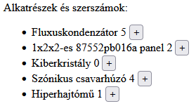
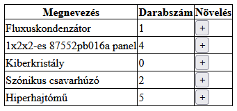

# Házi feladat (2 pont)

Az AmonGalactica űrutazási-ügynökség megtalálta a szabotőrt, így elkezdődhet a helyreállítás. A járművek javításra szorulnak, a technikusoknak pedig alkatrészek kellenek. Elkészítettek egy listát a gyakran használt alkatrészekből és szerszámokból, azonban még nem tudják, hogy miből mennyi fog kelleni.

```javascript
[
    'Fluxuskondenzátor',
    '1x2x2-es 87552pb016a panel',
    'Kiberkristály',
    'Szónikus csavarhúzó',
    'Hiperhajtómű'
]
```

## Feladat

Hozz létre egy listát az adatok alapján, ahol a tárgyak mellett egy darabszám (kezdetben 0) és egy gomb szerepel, amivel eggyel növelhető a darabszám. A feladatot megoldhatod rendezetlen listával és táblázattal is!

### Minta rendezetlen listával:



### Minta táblázattal:

