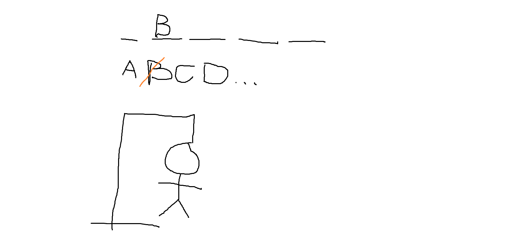

# Akasztófa játék megvalósítása

Célunk egy akasztófa játék egyszerű változatát megírni. Az általános lépések a következők:

1. A felület megtervezése
    - rajz
    - HTML, CSS
2. Adatok és függvények átgondolása (állapottér)
    - Az alkalmazáshoz működtetéséhez szükséges adatok definiálása
    - Felületfüggetlen feldolgozó függvények, amik az adatokat változtatják
3. Eseménykezelő függvények
    - Ezek kötik össze a felületet a feldolgozó függvényekkel
    - beolvasás, feldolgozás, kiírás
    - kiírásnál gondoljuk át, hogy hol használunk imperatív vagy deklaratív kiírást

## A felület megtervezése



A kiindulási kód (HTML és CSS) adott a sablonban.

## Állapottér

Gondoljuk át, milyen adatok kellenek a játék és a tervezett felület működtetéséhez:
- kell egy kitalálandó szó (`szo`)
  - ez alapján már generálható, hogy hány vonal kell
- kellenek az eddigi tippjeink
  - ez alapján megmondható, hogy a szóból mely betűket kell felfednünk
  - mely betűkre nem szabad már tippelni
  - nyertünk-e már (a szó összes karaktere szerepel a tippek között)
  - akár az is, hogy hány lépést kell kirajzolnunk
- hányat tippelhetünk
  - így megmondható, hogy vesztettünk-e már

Ezek alapján a következő adatokra van szükség:

```js
let szo = 'alma';
let tippek = ['a', 'b', 'c']
const MAXTIPP = 9
```

A felületfüggetlen feldolgozási logika a következő (állapottér változások):
- tippelés: egy új betűt tippelünk, ez a betű bekerül a tippek tömb elemei közé.
- nyertünk-e
- veszítettünk-e, ehhez kell a rossz tippek száma

Ezeket függvényekként kell megvalósítani. A függvények rálátnak a globális változókra, azokkal dolgoznak.

```js
function tippel(betu) {
  // a tippek tömbbe be kell tenni a betut
}
function nyer() {
  // a szo minden karakterére igaz, hogy a tippek tömb tartalmazza
  // milyen tétel?
  // milyen tömbfüggvény?
}
function veszit() {
  // a rossz tippek száma eléri a maximális tippek számát
}
function rosszTippek() {
  // a tippek tömbben hány olyan betű van, amit nem tartalmaz a szó
  // milyen tétel ez
  // milyen tömbfüggvény?
}
```

## Kiírás átgondolása

Igazából ez menet közben alakulhat, de előzetesen átgondolhatjuk, hogy a megoldás során hol fogunk imperatív és hol deklaratív megközelítést alkalmazni.

- **szó**: mivel a szó változhat a játékban, ezért a `#szo` div-en belüli `span`-okat tudnunk kell újra- és újragenerálni. Ez deklaratív, de mondhatjuk, hogy csak a játék elején van rá szükség. A tippelés során egy tippelt betű több karaktert is felfedhet a szóban. Ha imperatív megközelítést alkalmaznánk, akkor meg kellene tudni, hogy a szóban hányadik karakterek érintettek (kiválogatás), majd azokat a `span`-oknak az `innerHTML`-jét kellene beállítani. DE! Érdemes elgondolkodni, hogy vajon az előbb definiált span-kirajzolást nem tudjuk-e újrahasznosítani tippelés esetén is. Azaz minden tippeléskor újra- és újrarajzoljuk a kitalálandó szó betűit, attól függően fedve fel karaktereket, hogy szerepelnek-e a tippek tömbben. Ez a deklaratív megközelítés: nem érdekelnek az egyes változtatások, hanem az adatok alapján mindig újrarajzolom a felület egy részét. Ez sokkal kényelmesebb az esetek nagy többségében!
- **betűgombok**: ezeket be lehetne égetni a felületbe, de miért ne generálhatnánk le a tippelhető betűket is. Így meghagyhatjuk magunknak a lehetőséget, hogy később akár játékról játékra más betűkészletet adjunk. De egyelőre maradjunk a magyar karaktereknél. Az első megjelenítéshez biztosan le kell generálni a `button` elemeket. Ez deklaratív. Tippeléskor van választásunk: vagy újrahasználjuk az előző mindent kirajzoló függvényünket (deklaratív), vagy csak a tippelt gombot tesszük elérhetetlenné (imperatív).
- **játékállás**: ezt a kis részt szerintem érdemes mindig újra és újra generálni.
- **akasztófa rajz (svg)**: itt a `rajzol` stílusosztályt kell alkalmazni annyi svg elemen, ahány rossz tipp volt. Ezt lehet imperatívan.

Pár szó a kimenetgenerálásról. Ilyenkor hosszú HTML szövegeket kell előállítanunk, gyakran egy tömb elemei alapján. Ez megtehető sima ciklussal is:

```js
const tomb = [1, 2, 3]
let s = ''
for (let szam of tomb) {
  s = s + `<li>${szam}</li>`
}
```

De ezek helyett elegánsabb és rövidebb a másolás programozási tétel használata, amely minden elemhez hozzárendeli a neki megfelelő HTML szöveget. Ebben az esetben csak arra kell figyelnünk, hogy a végén a tömb elemeit egyetlen szöveggé fűzzük össze a `join` segítségével:

```js
const tomb = [1, 2, 3]
let s = tomb.map(szam => `<li>${szam}</li>`).join('')
```

Az eredmény ugyanaz.

Akkor ezek alapján a következő segédfüggvényekre, ún. HTML generátorokra lesz szükség:

```js
function genSzo() {
  // Cél a szó és tippek alapján:
  // <span>a</span>
  // <span>b</span>
  // <span></span>
  // <span class="hianyzo">b</span>
}
function genBetuk() {
  // Cél egy előre meghatározott betűtömb alapján:
  // <button>a</button>
  // <button disabled>b</button>
  // <button>c</button>
  // <button>d</button>
}
function genSzamlalo() {
  // Cél a rossztippek és a maxtippek alapján
  // 3/9
}
```

Az oldal betöltésekor
- legyen egy szó
- jelenítsük meg a betűit
- jelenítsük meg a gombokat

## Eseménykezelők

A játékban tkp. egyetlen esemény van, amikor a gombra kattintunk. Amit meg kell oldani, hogy sok gombunk lehet. Ebben az esetben nem a gombokhoz egyenként rendeljük az eseménykezelőt, hanem a buborékolást kihasználva egy szülőelemhez, és onnan delegáljuk vissza a gombhoz.

```js
betukDiv.addEventListener('click', gombraKattintas)
function gombraKattintas(e) {
  if (e.target.matches('button')) {
    // beolvasás
    // a lenyomott gomb szövege

    // feldolgozás
    // tippelés

    // kiírás
    // szó aktualizálása (genSzo)
    // betűk aktualizálása
    // számláló aktualizálása
    // akasztófarajz aktualizálása

    // opcionálisan
    // ha nyertünk, akkor tüntessük el a gombokat
    // ha nyertünk, akkor írjuk ki zölden a betűket, nyer stílusosztály
    // ha veszítettünk, akkor írjuk ki pirosan a ki nem talált betűket, hianyzo stílusosztály
  }
}
```

## Egyéb gondolatok

Érdemes a hivatkozott DOM elemeket egy-egy változóban vagy konstansban tárolni, hogy ne kelljen újra és újra lekérni őket.

```js
const szoDiv = document.querySelector('#szo')
const betukDiv = document.querySelector('#betuk')
const szamDiv = document.querySelector('#eredmeny')
const svg = document.querySelector('svg')
```

Az oldal indulásakor lefutó kódot is betehetjük egy külön függvénybe:

```js
let a
let b
function init() {
  a = 1
  b = 2
}
init()
```

Így később, a játék végén ezzel a függvénnyel alaphelyzetbe hozhatjuk a felületünket.
